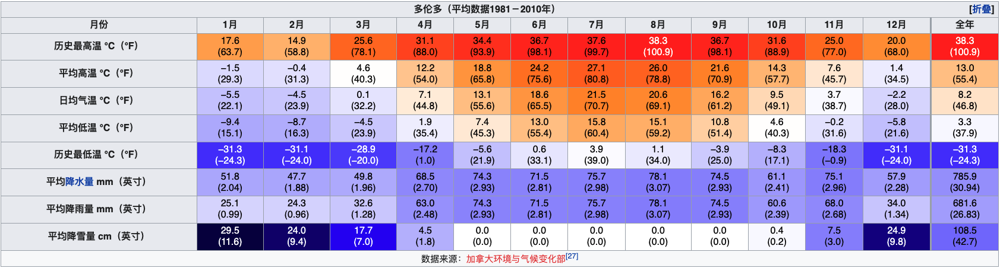

# Canada Climate Scraper

**Canada Climate Scraper** is a simple script written in Python that scrapes the [1981-2010 Climate Normals & Averages](https://climate.weather.gc.ca/climate_normals/) provided by the Government of Canada and changes the data into wikitext format to be used in the [Canada Climate Wiki](https://wiki.humboldt.ca/wiki/index.php/Canada_Climate_Wiki).

The output of the script is supposed to be rendered like this in Wikipedia:

